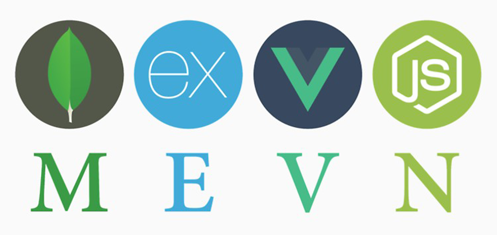

# 💥 MEVN Stack Blog



## 💻 Used Technologies
* Frontend: Vue.js + TailwindCSS / (Vite.js)
* Backend: Node.js / Express.js
* Database: MongoDB

## 🧐 How to Use
* Firstly clone the repo.
````bash
$ git clone https://github.com/orhanemree/MEVN-Stack-Blog.git
$ cd MEVN-Stack-Blog
````
* Start client side.
````bash
$ cd client
$ npm install
$ npm start
````
* Open a new terminal and start server side.
````bash
$ cd server
$ npm install
$ npm start
````
* Lastly start a local mongoDB database named "mevn-stack-blog" (you can remane in ``/server/DB.js`` file).

* Now visit ``localhost:3000``. Your local app is running at port 3000.

## ✨ Features
* [x] Login System
  - [ ] Error Messages in UI
* [x] Responsive Design

## 📃 License
* This project licensed under the [MIT License](https://github.com/orhanemree/MEVN-Stack-Blog/blob/master/LICENSE). 